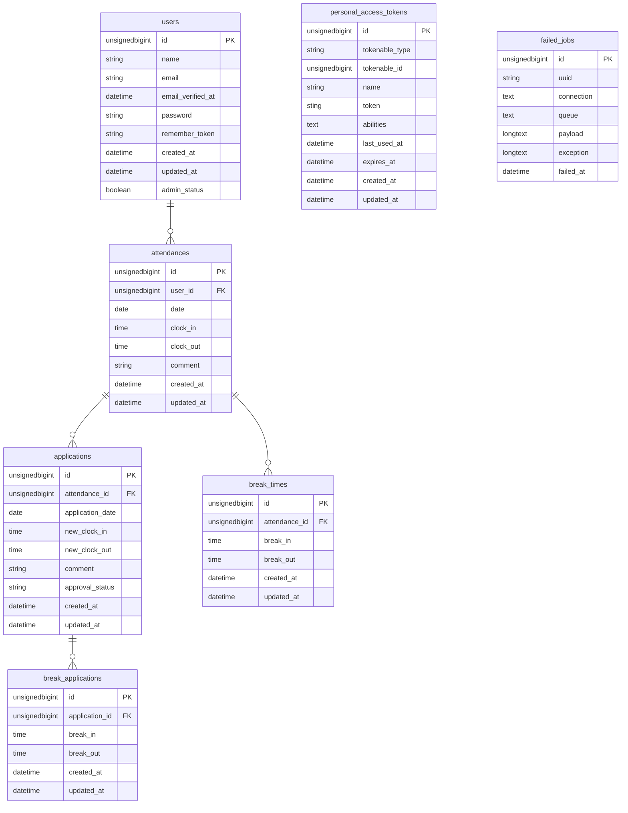

# 勤怠管理アプリケーション

出退勤休憩を打刻し、勤怠を管理するアプリケーションです


## 開発環境構築手順
>[!Important]
>gitとdockerコマンドを使用しますのであらかじめインストールを完了してください。

### 初回起動
```bash
# 1. リポジトリのクローン
git clone https://github.com/Yji-9261/attendance-app-mock-project.git
cd attendance-app-mock-project

# 2. Composerパッケージをインストールし依存関係を構築
docker run --rm \
    -u "$(id -u):$(id -g)" \
    -v "$(pwd):/var/www/html" \
    -w /var/www/html \
    -e COMPOSER_CACHE_DIR=/tmp/composer_cache \
    laravelsail/php82-composer:latest \
    composer install

# 3. 環境変数ファイルの作成
cp .env.example .env

# 4. ローカル開発サーバーの起動
./vendor/bin/sail up -d

# 5. アプリケーションキーの生成
./vendor/bin/sail artisan key:generate

# 6. データベースの設定
./vendor/bin/sail artisan migrate:fresh --seed

# 7. フロントエンド依存関係のインストールとビルド
./vendor/bin/sail npm install
./vendor/bin/sail npm run dev
```

> [!CAUTION]
> <details>
> <summary>⚠️ M1/M2/M3 Mac（Apple Silicon）をお使いの方</summary>
> 
>Apple Silicon搭載のMacでは、./vendor/bin/sail up -d実行時に以下のエラーが発生することがあります。
> ```bash
> no matching manifest for linux/arm64/v8
> ```
> 解決方法: compose.yamlを開き、mysqlサービスにplatform: 'linux/amd64'を追加してください。
> ```bash
> mysql:
>     image: 'mysql:8.4'
>     platform: 'linux/amd64'  # ← この行を追加
>     ports:
>         ...
> ```
> 編集後、保存してから./vendor/bin/sail up -dを実行してください。
> </details>

### 2回目以降の起動手順
```bash
    # ２回目以降は以下の２つのコマンド
    ./vendor/bin/sail up -d
    ./vendor/bin/sail npm run dev
```

> [!NOTE]
>./vendor/bin/sail npm run dev
>を実行したウィンドウは閉じないでください

## 動作確認方法
## web
#### 一般ユーザー1
http://localhost/login にアクセスし以下の情報でログインします
 - メールアドレス: user1@example.com
 - パスワード: password

#### 一般ユーザー2
http://localhost/login にアクセスし以下の情報でログインします
 - メールアドレス: user2@example.com
 - パスワード: password

#### 管理者
http://localhost/admin/login にアクセスし以下の情報でログインします
 - メールアドレス: user3@example.com
 - パスワード: password

## api
ここではPostmanを使用した動作確認方法を記載します。
[Postman公式サイト](https://www.postman.com/)からダウンロードしてインストールしてください。


#### API一覧

```
ログイン:      POST '/api/v1/attendance-records/login
勤怠一覧情報:   GET '/api/v1/attendance-records'
勤怠詳細情報:   GET '/api/v1/attendance-records/{attendance-record-id}'

[認証必須]
ログアウト:     POST '/api/v1/attendance-records/logout'
勤怠登録:       POST '/api/v1/attendance-records/'
勤怠更新:       PUT '/api/v1/attendance-records/{attendance-record-id}'
勤怠削除:       DELETE '/api/v1/attendance-records/{attendance-record-id}'
```

#### 認証について
1. ログインAPIへメールアドレスとパスワードを送信する。パラメータはmail,passwordでwebに記載しているものでログインしてください
2. 返ってきたトークンをコピーする
3. Authorizationタブを開く
4. Auth TypeにBearer Tokenを選ぶ、
5. Token欄へ貼り付ける。

#### apiステータスコード
| ステータスコード | 内容 |
| --- | --- |
|　200　|　api実行成功　|
|　201　|　勤怠登録成功　|
|　204　|　勤怠削除成功　|
|　401　|　未認証　|
|　403　|　管理者権限なし|
|　404　|　指定されたIDの勤怠なし|
|　405　|　該当apiなし|
|　422　|　入力エラー|


## アプリケーションの終了方法
```bash
    # 終了時は以下のコマンドを実行してください 
    ./vendor/bin/sail down
```

## コマンド一覧 
- サーバー起動: `./vendor/bin/sail up -d`
- サーバー終了: `./vendor/bin/sail down`
- マイグレーション実行: `./vendor/bin/sail artisan migrate --seed`
- テスト実行: `./vendor/bin/sail artisan test`

## 使用技術
- PHP 8.2
- Laravel10.
- データベース: MySQL
- フロントエンド: Blade,Tailwind.css

## 動作環境
- PHP >= 8.2
- laravel sail
- Tailwind.css
- vite

## URL
開発環境 http://localhost
mailpit http://localhost:8025
phpMyAdmin http://localhost:8080

## ER図

