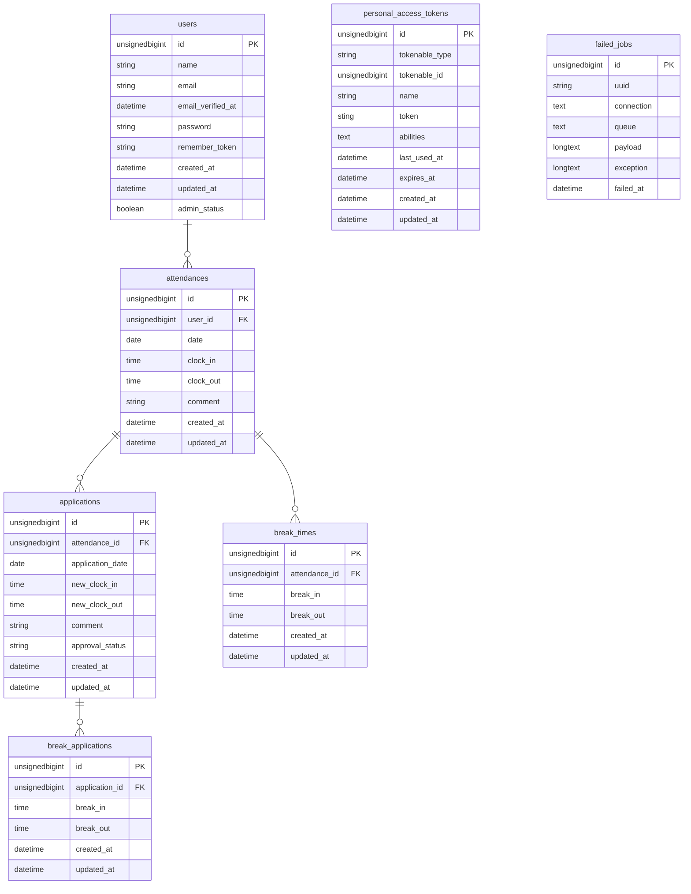

# お問い合わせフォーム

## coachtech勤怠管理アプリ
勤怠を管理するアプリケーションです。以下の操作が可能です。
- 出勤・退勤・休憩の打刻
- 勤怠の修正
- 勤怠一覧・詳細の表示
- 勤怠統計レポートの表示
- 月別勤怠データのCSV出力
- APIによる勤怠データの取得・登録・更新・削除

## 環境構築
#### 1. リポジトリのクローン
```bash
git clone https://github.com/Yji-9261/attendance-app-mock-project.git
cd attendance-app-mock-project
```

#### 2. 依存関係を構築
```bash
docker run --rm -u "$(id -u):$(id -g)" -v "$(pwd):/var/www/html" -w /var/www/html -e COMPOSER_CACHE_DIR=/tmp/composer_cache laravelsail/php82-composer:latest composer install
```

#### 3. 環境変数ファイルの作成
```bash
cp .env.example .env
```

#### 4. ローカル開発環境の起動
```bash
./vendor/bin/sail up -d
```
>[!NOTE]
>上記コマンドはエラーが発生することがあります。MYSQLがPC環境によって起動しない場合がありますので、使用している環境に合わせてcompose.yamlを編集してください。

#### 5. アプリケーションキーの生成
```bash
./vendor/bin/sail artisan key:generate
```

#### 6. データベースの設定
```bash
./vendor/bin/sail artisan migrate --seed
```

#### 7. フロントエンド依存関係のインストールとビルド
```bash
./vendor/bin/sail npm install
./vendor/bin/sail npm run dev
```

## 動作確認用アカウント
#### 一般ユーザー
http://localhost/login にアクセスし下記アカウントでログイン
 - メールアドレス: `user1@example.com` または `user2@example.com`
 - パスワード: `password`

#### 管理者
http://localhost/admin/login にアクセスし下記アカウントでログイン
 - メールアドレス: `user3@example.com`
 - パスワード: `password`

## API一覧
| 機能 | メソッド | パス| 認証|
| --- | --- | --- | --- |
| ログイン | POST | /api/v1/login | 不要 |
| ログアウト | POST | /api/v1/logout | 必要 |
| 勤怠一覧取得 | GET | /api/v1/attendance-records | 不要 |
| 勤怠詳細取得 | GET | /api/v1/attendance-records/{id} | 不要 |
| 勤怠登録 | POST | /api/v1/attendance-records | 必要 |
| 勤怠更新 | PUT | /api/v1/attendance-records/{id} | 必要 |
| 勤怠削除 | DELETE | /api/v1/attendance-records/{id} | 必要 |

### Postmanを用いた認証方法
1. ログインAPIにてログイン<br>
    ※ リクエストボディに下記パラメータを付与してください
    #### 一般ユーザー
   - email:`user1@example.com` または `user2@example.com`
   - password: `password`
    #### 管理者
   - email:`user3@example.com`
   - password: `password`
<br>
2. 返ってきたトークンをコピーする
3. Authorizationタブを開く
4. Auth TypeにBearer Tokenを選ぶ
5. Token欄へ貼り付ける

動作確認が終了したらログアウトAPIからログアウトしてください（パラメータは不要）

## 使用技術
- PHP 8.2
- Laravel 10.50
- MySQL 8.4

## ER図


## URL
- 開発環境 http://localhost<br>
- mailpit http://localhost:8025<br>
- phpMyAdmin http://localhost:8080<br>
